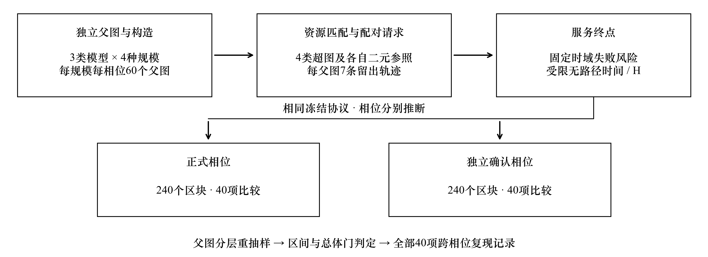
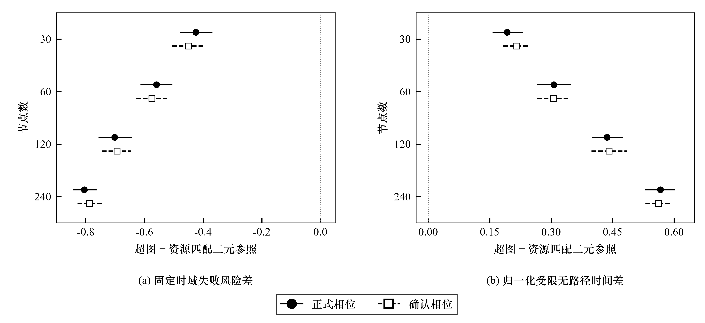
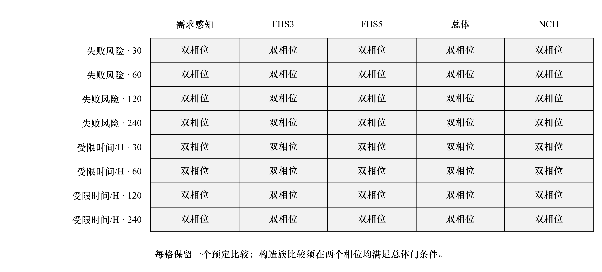

# 资源匹配下超图支付网络的服务可靠性

作者姓名【待填】

（作者单位、城市及邮政编码【待填】）

摘要：针对静态连通性难以反映超图支付网络持续服务能力、构造间资源投入不一致的问题，建立资源匹配的可靠性评估方法。以首次无可用路径为服务事件，结合原子支付、余额感知路由和父图分层重抽样，比较4类超图构造与二元基准。两独立相位各完成240个父图区块，40项比较均满足复现准则；确认相位总体失败风险差为−0.449～−0.787。在所设合成场景下，超图构造的服务收益伴随更高的协调暴露量。

关键词：区块链；超图支付网络；服务可靠性；资源匹配；余额感知路由；独立确认

中图分类号：【待核定】　文献标志码：A　DOI：【编辑部编定】

## Service reliability of hypergraph payment networks under resource matching

AUTHOR Names【to be completed】

Affiliations, city and postal code【to be completed】

Abstract: Static connectivity does not fully characterize sustained payment service in hypergraph payment networks, and comparisons between topology constructions may involve unequal resource inputs. A resource-matched service-reliability evaluation method was developed. First path unavailability was used as the service event, and atomic payments, balance-aware routing and parent-stratified bootstrap resampling were combined to compare four hypergraph construction families with binary references. Two independent phases each completed 240 parent-graph blocks, and all 40 contrasts met the registered replication criterion. In the confirmation phase, global failure-risk differences ranged from −0.449 to −0.787. Under the specified synthetic conditions, the observed service benefits co-occurred with higher coordination exposure.

Keywords: blockchain; hypergraph payment network; service reliability; resource matching; balance-aware routing; independent confirmation

通信作者：【姓名、电子邮箱待填】

基金项目：【名称、编号及英文名称待填；无资助时删除此项】

## 0 引言

支付信道网络（payment channel network，PCN）通过链下状态更新承载重复支付，将区块链用于结算和争议处理[1-2]。其服务能力同时受拓扑和方向性余额约束：静态路径可能因余额不足而无法支付，已完成的支付又会改变后续余额。因此，评价持续服务能力需要考察请求序列作用下的状态演化。

现有研究通过拥塞反馈路由[3]、动态选路[4]和链下重平衡[5]改善资金利用，也从信道设计[6]、需求感知构造[7]及拓扑映射[8]优化网络结构。Survivable Payment Channel Networks将余额耗尽停止时间引入容量分配[9]。这些工作采用的资源约束与失效事件各有侧重。

多方信道可用超边描述。Kotzer等[10]提出超图支付网络（hypergraph payment network，HPN）及节点覆盖、固定超边规模等构造；Corcoran等[11]研究多方路径规划。由单超边扩展至多超边后，一个余额坐标触零时其他路径可能仍可服务；反之，所有路径余额均不足以支付当前金额时，即使尚无坐标触零，请求也会失败。因此，局部边界事件与全局服务事件需要分别处理。

需要进一步回答的问题是：在节点资金、参与关系预算、请求和路由规则受控时，超图相对于二元支付网络的服务差异能否在独立数据中复现？增加超边规模可能同时增加资源投入；同一父图上的多条轨迹又具有依赖性。此外，训练目标改善不必然带来留出支付收益。

为此，建立资源匹配评估方法：在统一请求时钟下区分3类事件，以固定资金和参与关系预算构造二元参照，用共享请求及路由票据执行配对比较；在3类父图、4种规模和两个独立相位中，以父图为重抽样单元评价服务，报告协调开销及删失覆盖。需求感知搜索作为受评构造之一，其增量收益另作限定。

## 1 相关工作

### 1.1 余额感知路由与持续服务

方向性资金约束使路由具有跨请求耦合。Spider、Flash分别通过拥塞控制和动态选路改善流动性利用[3-4]，AERO考虑支付后的失衡程度[12]。这些方法的拆分、队列和信息条件不同。本研究固定原子单路径与余额感知规则，聚焦拓扑及其资金配置，不据此对已有路由算法排序。

文献[9]的耗尽停止时间为资金分配提供时间维度的依据。本研究保留耗尽记录，将主要终点定义为首次全局无可用路径，对应完整信息及全局搜索条件下的请求服务边界。

### 1.2 拓扑设计与多方支付网络

信道设计将交易需求、开设成本与资金约束纳入优化[6-8]，近期研究还联合考虑拓扑与交易选择[13]。多方信道扩大节点对覆盖范围，也改变参与负担与协调范围[10]，因而需要同时说明资金、参与关系及协调暴露量。

文献[10]和文献[11]分别提供了超图构造与多方路径规划的直接基础。本研究沿用相关构造类别，明确闭邻域节点覆盖规则，并增加需求感知局部搜索、二元参与关系匹配和跨相位确认。已有数学模型讨论了多方信道的可行状态与流动性几何结构[14]；Starfish探索基于局部星形结构的多方重平衡，其修订预印本已注明被High-Confidence Computing录用[15]。这些研究与本工作互补。本文的贡献定位于受控比较方法及其复现证据。

## 2 网络模型与服务事件

### 2.1 状态表示与原子支付

设支付超图为𝓗=(V,𝓔)，V为节点集合，𝓔为超边集合，n=|V|。对任意e∈𝓔和v∈e，用xₑ,ᵥ(t)表示第t次请求处理后的方向性余额。超边资金Cₑ为其成员余额之和；节点初始投入预算为Bᵥ。初始状态满足

$$ C_e=\sum_{v\in e}x_{e,v}(t),\qquad \sum_{e\ni v}x_{e,v}(0)=B_v. \tag{1} $$

请求qₜ=(sₜ,dₜ,aₜ)由源节点、目的节点和正整数金额组成。路径表示为节点与超边交替的序列P=(v₀,e₁,v₁,…,eℓ,vℓ)，其中v₀=sₜ、vℓ=dₜ且vⱼ₋₁,vⱼ∈eⱼ。所用路径不重复访问节点；对于每个局部转移，支付坐标须在请求前满足xₑⱼ,ᵥⱼ₋₁(t−1)≥aₜ。记满足这些约束的完整路径集合为𝓟ₜ。

接受请求时，各超边上的局部余额同时更新：

$$ x_{e_j,v_{j-1}}(t)=x_{e_j,v_{j-1}}(t-1)-a_t,\quad x_{e_j,v_j}(t)=x_{e_j,v_j}(t-1)+a_t. \tag{2} $$

其余坐标保持原值。所有局部转移须共同成功，禁止部分提交；拒绝请求不改变状态。由式(2)可知，一次局部转移的增减量相抵，因此每条超边的资金总额守恒，可行性检查同时保证更新后余额非负。实验不包含手续费、资金注入、支付拆分、重平衡及并发锁定过程。这些假设限定了服务事件的解释范围。

### 2.2 停止事件及其关系

请求时钟从1开始，计入每次尝试，包括被拒绝的请求。首次余额耗尽时间τdep为任一方向性余额首次等于0的时刻；若初态已有0余额，则τdep=0。首次无可用路径时间τnp定义为

$$ \tau_{\mathrm{np}}=\inf\{t\geq1:\mathcal P_t=\varnothing\}. \tag{3} $$

首次最终拒绝时间记为τrej。若截至观测时域未出现事件，保留右删失标志。核心实验采用完整状态、全局可行搜索和原子执行，且不存在非流动性拒绝原因，故τnp=τrej；二者仍分别存储，以兼容信息不足或候选路径受限等扩展协议。

τdep与τnp在一般金额请求下不存在无条件的先后顺序。例如，单条二元超边的双方余额均为5，首个请求金额为6，则第1次请求无可用路径，但余额未触零。反之，考虑A—B—C两条信道，A在A—B上的余额为1且其余方向余额充足。先执行A向B支付1，可使该坐标触零；随后B向C支付仍可成功，直至后续A的请求再次因资金不足而失败。上述示意说明，坐标边界的首次到达与请求级可行集合变空是不同事件。

因此，理论层保留余额过程、守恒关系及事件定义；实验层指定路由规则后评价τnp。单超边上的扩散近似或首次触零结论，需要在核对状态相关漂移、边界和路由耦合后才能推广至多超边情形。本研究不将单超边停止时间证明直接用作全网首次无可用路径的定理。

### 2.3 余额感知可行路由

每次请求根据当前余额生成有向残余可达关系，并搜索完整可行路径。路由按3级规则选择：首先最小化所经超边数；其次，在同长度路径中最大化支付后的最小归一化余额；最后，在仍并列的路径之间使用请求索引绑定的伪随机票据选择。路径的次级评分为

$$ b(P,q_t)=\min_{1\leq j\leq\ell}\frac{x_{e_j,v_{j-1}}(t-1)-a_t}{C_{e_j}}. \tag{4} $$

归一化余额以有理数精确比较。所有配对拓扑在请求t使用相同的64位主票据和确定性扩展票据，使并列路径数或早先失败次数的差异不改变后续票据。本实验不预先截取固定K条路径；“无可用路径”因而对应所定义残余网络中的全局不可行，而非候选集合搜索失败。

## 3 资源匹配与需求感知构造

### 3.1 超图构造及二元参照

每个父图G=(V,E)生成4类超图：节点覆盖超图（node cover hypergraph，NCH）、最大超边规模分别为3和5的固定规模超图FHS3、FHS5，以及由FHS5初始化的需求感知超图。NCH采用确定性局部比率2近似顶点覆盖，并以选中中心及其邻居组成闭邻域超边。该规则对文献[10]开邻域伪代码作明确的语义修订，使中心属于自身信道，并避免由开邻域解释造成的单成员信道问题。

FHS依次选择规范顺序下剩余度最大的节点，以广度优先搜索获取不超过给定规模的连通成员集，构成超边后删除成员集诱导的父图边，直至父图边被覆盖。需求感知构造与其种子使用相同的节点集合、参与关系预算和最大超边规模。这里的参与关系预算定义为

$$ L=\sum_{e\in\mathcal E}|e|=\sum_{v\in V}\deg_{\mathcal H}(v). \tag{5} $$

每个超图构造分别配置自己的二元参照。选择器先从父图边中按种子优先顺序生成Kruskal生成树，再补入其余父图边，必要时才考虑非父图节点对。每条二元边消耗2个参与关系。当L为可行的偶数时进行精确匹配；L为奇数时分别保留L−1和L+1的两个二元参照，计算其终点的等权均值。上下参照是邻近预算比较，不表述为单个精确匹配网络。

匹配控制了节点集合、总参与关系和每节点初始资金，但未固定每节点参与度、节点对覆盖数或路径长度。后几项正是构造所改变的结构特征，应通过描述性结果解释。二元团展开只用于基础设施成本参照，不作为额外的服务竞争组，也不增加样本量。

### 3.2 需求感知目标与局部搜索

以训练请求的金额加权和构造有向需求矩阵D，Dᵤᵥ表示u向v的训练需求量。令mᵤᵥ为同时包含u、v的超边数；mᵤᵥ>0时称该节点对被覆盖。优化目标由4项组成：覆盖的双向需求R、覆盖的方向失衡I、节点重复参与负担P，以及超边协调与重复覆盖负担O。

$$ R=\sum_{u<v:m_{uv}>0}\min(D_{uv},D_{vu}),\quad I=\sum_{u<v:m_{uv}>0}|D_{uv}-D_{vu}|. \tag{6} $$

$$ P=\sum_{u\in V}\binom{\deg_{\mathcal H}(u)}{2},\quad O=\sum_{e\in\mathcal E}\binom{|e|}{2}+\sum_{u<v}\binom{m_{uv}}{2}. \tag{7} $$

双向需求项与失衡项分别用全体节点对的可用双向需求量和总方向失衡归一化，参与及协调项使用由L和最大超边规模导出的预算界。分母为0的项按0处理。记归一化结果为带横线的符号，则训练评分为

$$ J=\bar R-\frac{1}{2}\bar I-\frac{1}{4}\bar P-\frac{1}{4}\bar O. \tag{8} $$

候选构造须保持节点集合和精确参与关系预算，满足最大超边规模、成员集在父图中连通、父图边覆盖、无重复超边以及关联超图连通等约束。候选池由父图边及规范顺序、需求优先顺序下的连通扩展组成。局部搜索允许等参与关系替换、拆分、合并及最多涉及3条超边的联合移动，在至多2轮改进中检查不超过5000个提案，仅接受严格提升目标的候选，并以规范指纹消解并列。该过程是有界确定性启发式搜索，不保证全局最优。

训练目标用于选择结构，留出请求及其服务结果不进入构造接口。即使J提高，也不能直接推出τnp改善；两者之间的关系需要单独实验检验。因此，需求感知超图与二元参照的比较，仅评价最终构造的服务表现，不等同于相对于FHS5种子的训练消融。

### 3.3 共同资金配置

每节点初始资金固定为120，仅在该节点参与的超边间分配。所有拓扑使用相同的配置过程和评分预算。候选初态包括商余数均匀分配和负载风险分配；后者在每个节点参与坐标预留1个单位，再依据相关成员间的双向需求量与方向失衡量，以Hamilton最大余数法分配剩余资金。

两种基线中的较优状态用于初始化共同投影细化，冻结方案总计评价4个状态，并采用每个转移步长级2个提案的预算。每次提案选择一个节点及其资金转出、转入超边，在整数单纯形上调整资金。只有训练评分严格按字典序改善时才保留候选；科学评分相同时以指纹确定保留状态，该操作不计为服务改善。均匀基线、每次提案和最终状态均保留，便于精确重放。

## 4 实验设计与统计方法

### 4.1 父图与支付负载

实验采用连通条件下的固定边数ER随机图（ER-GNM）、Barabási–Albert图（BA）和固定边数随机块模型（SBM）3个结构层，节点数为30、60、120和240。每个规模、每个模型生成20个独立父图。BA采用冻结的星形初始化及每次3条附着边，统一父图边数为3(n−3)；ER-GNM和SBM匹配相同边数。SBM包含4个规范社区，4种规模的社区内边数依次为60、128、263和533。无效或不连通样本按冻结规则重抽，最多1000次，并记录接受时的种子与尝试序号。

每个父图区块使用均匀有序节点对、社区内偏好、外生指定的3节点热点和方向漂移4种训练需求。每一有序源目的对均有正权重；金额取1、3、6，对应权重6、3、1。端点与金额使用分离的种子命名空间。训练完成后，使用4条同分布留出轨迹和3条分布偏移轨迹；偏移分别为热点迁移、方向反转及跨社区需求增强。社区、热点与方向组由规范节点标签确定，不由测试表现选择。

每条留出轨迹包含H=12n次尝试。所有配对变体接收相同的请求对象、金额及路由票据，首次失败后仍运行至共同观测终点。正式相位与确认相位使用分离的根种子2026081001和2026081002，每相位共4×3×20=240个父图区块。流程如图1所示。

图1　资源匹配评估与独立确认流程。每种规模、每个相位含60个独立父图；同一父图内7条留出轨迹属于嵌套测量。两相位采用相同协议、分别分析。

### 4.2 主要终点及配对效应

主要终点为归一化受限无路径时间Y和固定时域失败指示F。令T=min(τnp,H)，δ表示截至H是否观察到无路径事件，则Y=T/H、F=δ。删失观测保存T=H及δ=0；恰在H发生事件时T同为H，但δ=1。因此，两个终点分别反映首次服务中断的相对时间与观测期内是否发生中断。

对于构造族f及其Kf个二元参照，任一终点Z∈{Y,F}的配对差定义为

$$ d_f^{(Z)}=Z_f-\frac{1}{K_f}\sum_{k=1}^{K_f}Z_{f,k}^{(B)},\qquad d_{\mathrm{global}}^{(Z)}=\frac{1}{4}\sum_f d_f^{(Z)}. \tag{9} $$

Y的差值为正、F的差值为负时表示有利方向。F是“截至H至少出现一次全局不可行请求”的指示，不是全部请求的失败比例；两组F均值之差为绝对概率差，不解释为相对下降百分比。总体对比对4类构造等权，奇数预算所增加的二元参照不提高该构造的权重。

### 4.3 分层推断与复现准则

先在每个父图区块内分别求4条同分布轨迹和3条偏移轨迹的平均差，再按4∶3合并，得到1个父图观测。每个规模先求3个模型层内的均值，再对层均值等权平均。由此，每相位、每规模的独立重复数为60，轨迹数、构造数及二元参照数均不计作额外独立父图。

采用父图分层聚类bootstrap，各层每次有放回抽取20个父图，进行20000次重抽样，根种子为2026081003。同一局部层级中的5项对比共享重抽样索引。2个终点与4种规模组成8个局部层级，每层级包含1项总体对比和4项构造族对比，共40项预定比较。只有对应总体区间完全位于有利方向，构造族比较才具有确认性解释。

按冻结的Bonferroni分配，为每相位40项比较配置研究层面的95%名义家族水平；每个区间使用校正后经验尾概率1/1600，即局部名义水平159/160。该分配与percentile bootstrap共同构成推断程序，不意味着有限样本下已证明精确覆盖率。区间与门控判断采用未舍入的精确分数，显示值仅用于报告。

总体比较须在两相位中均得到有利区间才满足独立确认；构造族比较还要求两相位对应总体门均开启。两相位分别推断、不合并样本，95%的家族水平分别适用于每相位40项区间，不作为跨相位80项区间的联合保证。

### 4.4 删失、成本与计算复现

下分位水平q=0.10仅用于事件覆盖诊断。一个父图只有在源超图及其全部二元参照的事件观测比例均不低于0.10时才通过；某个相位、规模、模型、构造族和负载范围组成的单元，须全部父图通过才标记为完全覆盖。本研究不据此估计数值化的0.10停止时间分位数。

成本按分量报告，包括节点对覆盖与覆盖重数、初末余额失衡、终态零坐标比例、每次尝试的跳数与经过超边数、瓶颈余额量、信令参与槽位及参与人数、二次协调暴露量和最优路径重数。信令与协调量是协议定义的计数或暴露指标，不是实测通信时延、手续费或货币成本。可靠性与成本不合成为任意标量评分。

每个区块绑定拓扑、初态、请求轨迹及路由选择的SHA-256指纹，经冻结输入精确再生核对后写入结果。两相位均完整完成后再生成统计证据；分析阶段采用可恢复的分块检查点，并对分析输出进行独立重放核验。原始区块、运行记录、全部比较、描述性投影及图表源数据均保留。

分析模式及复现状态机在正式相位已完成15个区块后、正式推断前补充，当时仅查看一条留出记录以识别字段结构，未计算汇总效应或区间。后续内存与并行执行修订改变进程划分及读取方式，保持冻结输入、模拟代码、终点和推断规则。该时间顺序作为方法修订披露，而不追溯表述为全部在最初运行前完成。

## 5 结果与分析

### 5.1 资源匹配下的总体服务差异

两相位均完成全部240个父图区块，形成完整的合成网络证据。8项总体比较均满足独立确认准则，具体效应和校正区间见表1，图2展示两相位估计及区间的位置。正式相位在30、60、120和240节点下的失败风险差依次为−0.425、−0.559、−0.701和−0.805；确认相位对应为−0.449、−0.575、−0.693和−0.787。确认相位240节点的估计表示固定时域内首次无路径事件的发生概率平均相差−0.787，即−78.7个百分点，不表示失败风险相对下降78.7%。

{{TABLE_GLOBAL}}

表1　超图构造相对于资源匹配二元参照的总体配对效应。括号内为多重比较校正后的bootstrap区间；每相位每行含60个独立父图。失败风险差为负、归一化受限时间差为正表示有利方向。

归一化受限无路径时间的正式相位差值为0.192、0.307、0.437和0.566，确认相位为0.216、0.305、0.441和0.562。两相位各规模区间均位于正侧，表明在共同请求时域内，超图构造相对于其匹配二元参照较晚出现首次服务中断，或更常保持至观测终点。这里的时间以请求序号计量，不能直接换算为秒，也不代表无限时间的网络寿命。

图2　两相位总体服务效应。(a)固定时域失败风险差；(b)归一化受限无路径时间差。圆点与方点分别表示正式和确认相位；水平线为校正区间，虚线为零差。每个估计均由60个父图形成，重抽样次数为20000。

随规模增大，总体失败风险差的绝对值与归一化受限时间差均呈增大的描述性趋势。不过，规模变化同时改变边数与请求时域，且没有为规模间差异另设确认性检验。因此，该趋势只描述4个预定规模下的结果，不构成关于任意规模单调改善的定理。

### 5.2 构造族与父图结构的复现

两相位全部总体门均开启。需求感知超图、FHS3、FHS5和NCH在2个终点、4种规模上的32项构造族比较，校正区间均在两相位中位于有利方向；加上8项总体比较，40项记录均满足独立确认准则。完整状态矩阵见图3，未出现仅正式相位、仅确认相位或两相位均未通过的记录。

图3　全部40项比较的跨相位复现。每格对应一个终点、规模与构造族或总体对比，“双相位”表示两相位的校正区间均有利且适用的总体门均开启。构造族比较分别针对各自二元参照，不表示超图构造之间的两两排序。

按父图模型进一步展开，每相位5类对比（含总体）、4种规模和3个模型组成60个描述性单元；失败风险均值全部为负，归一化受限时间均值全部为正。方向一致性覆盖BA、ER-GNM和固定边数SBM，但这些分层均值不构成新增的独立检验，也未验证3类模型的效应相等。各单元20个父图的原值、均值及范围保存在源数据中。

### 5.3 删失覆盖与需求感知构造的活动范围

服务效应的跨相位复现并不意味着所有停止时间特征都已可识别。每相位96个覆盖诊断单元中，仅2个满足所有父图及其全部参照的q=0.10事件覆盖规则，均为FHS3在固定边数SBM、同分布范围、120和240节点下的单元。正式相位有34个单元、确认相位有24个单元没有任何父图通过联合覆盖规则，其余为部分覆盖。这些数目统计的是单元，同一父图会在不同构造和负载范围内重复出现。本研究未报告0.10分位数的数值估计。

需求感知训练在4种递增规模下，分别改变正式相位60个父图中的33、21、5、1个种子拓扑，确认相位对应为34、16、13、1个。到240节点时，两相位的改变组均仅有1个父图，分别来自BA和ER-GNM，其余两个模型层为空，因而无法形成等模型权重的改变组均值。未改变组在两相位的失败风险均值差分别为−0.922和−0.898，归一化受限时间均值差为0.638和0.647。

上述分组仍然是最终超图相对于二元参照的描述性比较，不是改变前后拓扑的配对因果效应。尤其在大规模下，改变组过小，当前数据不能支持“训练带来额外服务收益”的结论。结果反而提示，需要将种子本身的多方结构效应与局部搜索的增量作用分开检验。

### 5.4 服务收益与协调开销

每相位均保留4种规模与4类源构造组成的16个等模型均值单元，以及全部13个描述指标。在全部16个单元中，超图构造相对于二元参照具有更高的节点对覆盖与覆盖重数、更低的初末余额失衡及终态零坐标比例。按尝试归一的路由跳数、经过超边数与瓶颈余额量也均较低；信令参与槽位、独立信令参与者数量和二次协调暴露量则均较高。两项最优路径重数指标的差值符号随单元变化。

二次协调暴露量差的正式相位范围为6.857～316.591，确认相位为6.886～306.536。该结果说明，较短的超边路径与较少的经过超边数，未必对应较低的参与者协调负担。节点对覆盖和余额分散可能参与形成观察到的服务差异，但现有联合比较未隔离这些因素，不能据此认定具体因果机制。工程设计应将服务事件与多方协调分量同时纳入评估。

正式与确认相位记录的区块生成耗时之和分别为294.922和264.831区块小时，精确验证耗时之和为340.418和299.433区块小时。这里累加的是各区块实际经历的时长，既非端到端墙钟时间，也非CPU小时；后续相位推断和描述性投影耗时不在其中，因此不能用作并行加速比。两相位运行记录均为Windows AMD64上的CPython 3.12.13，现有摘要未提供全程峰值内存。

## 6 讨论

结果表明，在所设资金、参与关系、负载和路由约束下，超图构造相对于二元参照的服务效应具有跨相位一致性。该证据将多超边状态更新、全局可行路径与独立父图重复结合起来，适用于当前受控比较，尚不足以推广至所有业务和协议。

资源匹配未固定节点参与度序列和节点对覆盖，这些差异属于被比较的结构组成。奇数预算的上下参照均值则具有预算邻域含义，不对应实际运行的“平均网络”。因此，匹配不意味着全部成本分量相同。

余额隐私、探测、手续费、重试及并发占用会改变实际可行集合与拒绝原因；协调计数也不能代替实现级时延或费用。向真实部署推广需要补充信息不完备与并发协议验证。

每个模型层仅含20个父图，percentile bootstrap的尾部近似可能影响区间稳定性，多重比较分配不消除该误差。q=0.10覆盖不足限制了低分位分析。确认相位仍采用相同合成机制，无法据此估计真实闪电网络的失败率。

后续可增加需求感知构造相对于FHS5种子的直接配对消融，检验搜索增量；在不同请求时域与资金预算下验证趋势；测量多方协调对应的通信和锁定时延。

## 7 结束语

围绕多超边支付网络的持续服务问题，建立了资源匹配、状态化配对执行和父图分层独立确认相结合的评估方法。该方法将首次无可用路径与首次余额耗尽分开记录，以固定时域失败风险和归一化受限无路径时间评价服务，在共同资金与参与关系约束下比较4类超图构造及其二元参照。两独立相位各240个父图区块的结果表明，全部40项预定比较满足复现准则，观察到的服务收益同时伴随更高的多方协调暴露量。结论适用于当前合成父图、负载、资金和余额感知路由设置，为进一步研究信息约束及实现成本提供了可复用的比较基础。

## 数据与代码

实验代码、配置、运行与验证记录、相位分析证据和图表源数据保存在项目仓库中（https://github.com/megumidaisuki-jth/secondaryexploration）。正文数字可追溯至完整比较登记表和描述性汇总。本稿只使用已完成的合成网络数据，公开拓扑截面不参与当前结果。持久化归档标识及最终代码、数据许可证将在投稿材料中补充。

## 参考文献

[1] PAPADIS N, TASSIULAS L. Blockchain-based payment channel networks: challenges and recent advances[J]. IEEE Access, 2020, 8: 227596-227609. DOI: 10.1109/ACCESS.2020.3046020.

[2] 徐秀, 田安琪, 何瑞雯. 基于区块链的支付信道网络：挑战与发展[J]. 通信学报, 2024, 45(Z1): 97-104. DOI: 10.11959/j.issn.1000-436x.2024217.

[3] SIVARAMAN V, VENKATAKRISHNAN S B, RUAN K, et al. High throughput cryptocurrency routing in payment channel networks[C]//Proceedings of the 17th USENIX Symposium on Networked Systems Design and Implementation. Santa Clara, USA: USENIX Association, 2020: 777-796.

[4] WANG P, XU H, JIN X, et al. Flash: efficient dynamic routing for offchain networks[C]//Proceedings of the 15th International Conference on Emerging Networking Experiments and Technologies. Orlando, USA: ACM, 2019: 370-381. DOI: 10.1145/3359989.3365411.

[5] KHALIL R, GERVAIS A. Revive: rebalancing off-blockchain payment networks[C]//Proceedings of the 2017 ACM SIGSAC Conference on Computer and Communications Security. Dallas, USA: ACM, 2017: 439-453. DOI: 10.1145/3133956.3134033.

[6] AVARIKIOTI G, WANG Y, WATTENHOFER R. Algorithmic channel design[C]//29th International Symposium on Algorithms and Computation. Dagstuhl: Schloss Dagstuhl–Leibniz-Zentrum für Informatik, 2018, 123: 16:1-16:12. DOI: 10.4230/LIPIcs.ISAAC.2018.16.

[7] KHAMIS J, ROTTENSTREICH O. Demand-aware channel topologies for off-chain payments[C]//2021 International Conference on COMmunication Systems & NETworkS. Piscataway: IEEE, 2021: 272-280. DOI: 10.1109/COMSNETS51098.2021.9352899.

[8] KHAMIS J, KOTZER A, ROTTENSTREICH O. Topologies for blockchain payment channel networks: models and constructions[J]. IEEE/ACM Transactions on Networking, 2024, 32(6): 4781-4797. DOI: 10.1109/TNET.2024.3445274.

[9] PODIATCHEV Y, ORDA A, ROTTENSTREICH O. Survivable payment channel networks[J]. IEEE Transactions on Network and Service Management, 2024, 21(6): 6218-6232. DOI: 10.1109/TNSM.2024.3456229.

[10] KOTZER A, LADÓCZKI B, TAPOLCAI J, et al. Addressing scalability issues of blockchains with hypergraph payment networks[J]. IEEE Transactions on Network and Service Management, 2025, 22(3): 2427-2440. DOI: 10.1109/TNSM.2025.3542960.

[11] CORCORAN P, LEWIS R. Path planning in payment channel networks with multi-party channels[J]. Distributed Ledger Technologies: Research and Practice, 2025, 4(4): 1-14. DOI: 10.1145/3702248.

[12] HUANG L, HUO C, GE C, et al. AERO: an adaptive and efficient routing for off-chain payment channel networks[J]. Computer Networks, 2025, 257: 111009. DOI: 10.1016/j.comnet.2024.111009.

[13] CHATTERJEE K, KŘIŠŤAN J M, SCHMID S, et al. Boosting payment channel network liquidity with topology optimization and transaction selection[C]//39th International Symposium on Distributed Computing. Dagstuhl: Schloss Dagstuhl–Leibniz-Zentrum für Informatik, 2025, 356: 23:1-23:22. DOI: 10.4230/LIPIcs.DISC.2025.23.

[14] PICKHARDT R. A mathematical theory of payment channel networks[EB/OL]. (2026-01-08)[2026-09-29]. https://arxiv.org/abs/2601.04835. 预印本.

[15] YU W, XU M, ZHANG Y, et al. Starfish: rebalancing multi-party off-chain payment channels[EB/OL]. (2026-09-21)[2026-09-29]. https://arxiv.org/abs/2504.20536v2. 修订预印本.

## 作者简介

【作者姓名、出生年、学位、单位、职称及主要研究方向待填；照片由作者提供】
