# Methods (working draft)

> **Drafting argument.** In hypergraph payment networks, we evaluate how
> topology, traffic and balance-aware routing jointly shape service reliability
> using resource-matched topologies, train-once held-out evaluation, paired
> request traces and parent-stratified inference; conclusions are bounded to the
> registered synthetic and structural-panel conditions and do not presume a
> universally superior topology.

## Study overview and phase separation

We designed a paired computational study of service reliability in hypergraph
payment networks (HPNs). The study separates topology training, held-out
evaluation and statistical confirmation. Each synthetic parent graph generates
the same registered topology families and their resource-matched binary
references. The resulting variants receive identical per-node capital, are
trained with the same demand records and optimization budgets, and are then
evaluated on immutable paired request traces. The formal and confirmation
phases use disjoint root-seed families and are analysed separately; a finding
is independently confirmed only when the registered interval and hierarchy
conditions are satisfied in both phases.

The complete workflow is shown below. Scientific endpoint values are not read
from incomplete phases. A phase enters inference only after all 240 registered
parent-model blocks have been strict-loaded and a complete canonical summary
has been rebuilt.

```mermaid
flowchart LR
    A["Connected ER-GNM, BA and fixed-count SBM parent graphs"] --> B["Four training-demand regimes"]
    B --> C["NCH, FHS3, FHS5 and demand-aware HPN construction"]
    C --> D["Resource-matched binary references and common capacity allocation"]
    D --> E["Seven held-out paired request traces"]
    E --> F["Request-clock service and component-wise cost records"]
    F --> G["Trace means within parent graphs"]
    G --> H["Stratified parent-cluster bootstrap"]
    H --> I["Separate formal and confirmation decisions"]
```

## Hypergraph state and atomic payment semantics

An HPN is a finite hypergraph `H=(V,E)`. For each participant `v` in a
hyperedge `e`, `x_{e,v}` denotes its directional balance, and the sum of member
balances within a hyperedge is conserved in the core model. A payment request
specifies a source, destination and positive integer amount. A route is an
ordered sequence of hyperedge-local transfers. A route is feasible only when
every paying coordinate contains at least the requested amount. Accepted
payments update every traversed hyperedge atomically; partial route updates are
forbidden. Rejected requests leave the complete balance state unchanged.

All service events use a one-based request clock that indexes every attempted
request, including rejected requests. We record first directional-balance
depletion (`tau_dep`), first globally infeasible request (`tau_nopath`) and
first final rejection (`tau_rej`) with separate observation flags. An initially
zero directional balance gives `tau_dep=0`; otherwise depletion can arise only
after an accepted atomic payment. In the core experiment, complete state
information, exhaustive feasible search and the absence of non-liquidity
rejection causes make `tau_nopath` and `tau_rej` coincide. They remain separate
records because protocol sensitivities can break this equality. Simulation
continues after the first failure to the common administrative horizon.

## Balance-aware feasible routing

For each request, the router constructs the directed residual hypergraph from
the current balance state and performs a complete global feasible-path search.
It first minimizes the number of traversed hyperedges. Among equal-length
paths, it maximizes the minimum normalized post-payment directional balance,
`(x_{e,v}-a) / sum_u x_{e,u}`, over all paying coordinates. Exact rational
arithmetic is used for this comparison. Remaining ties are resolved using a
request-indexed computationally pseudorandom quantile.

The routing ticket for request `i` is derived from the routing root seed and
the semantic namespace `routing.ticket`. The same leading 64-bit ticket and,
when required, the same deterministic extension blocks are supplied to every
topology in a pairing block. Consequently, topology-dependent tie counts or
earlier failures cannot desynchronise later paired route choices. Primary
experiments do not replace the complete search with a precomputed `K`-path
candidate set.

## Synthetic parent-graph strata

We study node counts `n in {30,60,120,240}`. Within each size, we generate 20
independent parent graphs in each of three declared structural strata:
connected conditional fixed-edge ER-GNM, a frozen star-initialized
Barabási–Albert process, and a fixed-count stochastic block model. The BA
attachment count is three, fixing the common edge count at `3(n-3)`; ER-GNM
and fixed-count SBM draws use the same exact edge count. Fixed-count SBM cells
use four canonical community blocks and exact within-block edge counts of
60, 128, 263 and 533 at the four sizes, respectively. Disconnected or invalid
draws are rejected under a frozen ceiling of 1,000 attempts, and every accepted
edge set is replayed from its namespaced seed and recorded attempt index.

The formal phase therefore contains 240 parent-model blocks: four sizes,
20 parent replicates and three model strata. The confirmation phase repeats
the same design with a disjoint root seed. ER-GNM, BA and fixed-count SBM are
treated as distinct strata rather than exchangeable draws from one pooled
graph distribution.

## Payment-topology construction and resource matching

Each parent graph produces four source HPN families: a closed-neighborhood Node
Cover Hypergraph (NCH), Fixed Hyperedge Size 3 (FHS3), Fixed Hyperedge Size 5
(FHS5) and a demand-aware HPN initialized from FHS5. NCH uses
a frozen canonical-order local-ratio 2-approximate vertex cover and creates a
closed-neighborhood hyperedge for each selected centre. This closed-neighborhood
rule is a registered semantic correction to the uploaded study's literal
open-neighborhood pseudocode, which can create singleton channels and omit a
cover node from its own channel. FHS selects the
canonical maximum-residual-degree node, performs canonical breadth-first search
up to the declared maximum arity, creates a hyperedge from the visited nodes,
and removes the parent edges induced by that set. The complete topology,
construction version and tie rules are fingerprinted.

For each HPN source family, a binary reference is selected under the same node
set and incidence budget. The selector first constructs a seed-priority
Kruskal spanning tree from parent edges, adds remaining parent edges, and only
then considers non-parent pairs. Exact matching is used for feasible even
incidence budgets. For odd budgets, the registered lower and upper binary
brackets differ by one incidence and remain separate arms; neither is labelled
an exact match. Binary clique expansions are retained only as component-wise
infrastructure-cost references and are not evaluated as duplicate service
competitors.

## Training demand and held-out workloads

Each block uses four training regimes: uniform ordered pairs,
community-local demand, an exogenously labelled three-node hotspot regime and
directional drift. Every ordered source-destination pair receives a positive
integer weight. Training endpoints and amounts use separate seed namespaces,
and the amount distribution assigns values 1, 3 and 6 weights 6, 3 and 1,
respectively. The training demand matrix is amount weighted,
`D[u,v]=sum a` over training requests from `u` to `v`.

After topology and capacity training, seven held-out traces are evaluated:
four same-distribution traces and three shifts comprising hotspot relocation,
direction reversal and increased cross-community demand. Canonical node labels,
not topology centrality or held-out performance, define communities, hotspots
and directional groups. Every trace contains `H=12n` attempted requests, and
the exact same request objects and request-indexed routing-ticket family are
reused across all paired variants.

## Demand-aware topology training

The demand-aware constructor optimizes a four-term exact objective under the
same node set, incidence budget and maximum arity as its registered seed. For
unordered pair `{u,v}`, let `m[u,v]` be the number of hyperedges containing
both nodes, and call a pair captured when `m[u,v]>0`. The objective rewards
captured bidirectional demand,
`R=sum_captured min(D[u,v],D[v,u])`, and penalizes captured directional
imbalance, `I=sum_captured |D[u,v]-D[v,u]|`. Node-participation burden is
`P=sum_u choose(deg_H(u),2)`. Coordination and overlap burden is
`O=sum_e choose(|e|,2)+sum_{u<v} choose(m[u,v],2)`. The normalized terms
receive weights `1`, `1/2`, `1/4` and `1/4`, respectively, in the score
`R_norm - I_norm/2 - P_norm/4 - O_norm/4`, evaluated with exact rational
arithmetic. Demand terms are normalized by the available bidirectional volume
and directional imbalance, whereas participation and coordination terms use
bounds derived from the incidence and arity budgets; a zero denominator
contributes exact zero.

A feasible candidate must preserve the parent node set and exact incidence
budget, respect the maximum arity, contain only parent-connected member sets,
cover every parent edge, contain no duplicate hyperedges and remain connected
as an incidence hypergraph. For the formal sizes, the candidate pool contains
all parent edges plus canonical and demand-prioritized connected expansions.
The bounded local search considers equal-incidence replacement, split, merge
and multi-edge moves of width at most three. It consumes at most 5,000
proposals across at most two improving rounds and retains the best strict
objective improvement with canonical fingerprint tie-breaking. This search is
a declared deterministic heuristic, not a global-optimality claim. Held-out
requests and service outcomes are absent from the training API.

## Common capacity allocation

Every node receives an integer capital budget of 120, which is reallocated
only among that node's incident hyperedges. The same capacity procedure and
evaluation budget are applied to every topology. A uniform quotient-remainder
allocation and a load/risk allocation are both evaluated. The latter reserves
one unit per node-incidence coordinate and apportions the remainder by exact
Hamilton largest remainders using the weight
`1 + sum_v(D_uv+D_vu) + sum_v|D_uv-D_vu|` for the other members of each
incident hyperedge.

The lexicographically better baseline initializes a common projected
refinement. The frozen plan evaluates four states in total, using two
proposals per transfer-step level. Deterministic tickets select a node and an
ordered donor-recipient pair on that node's positive integer simplex. A
proposal is accepted only under strict lexicographic improvement of the
registered robust training score. Scientific score components are compared
before the canonical state fingerprint; when all scientific components tie,
the fingerprint determines the retained state and is not interpreted as a
service improvement. The uniform baseline, every proposal and the final state
are retained for complete replay.

## Paired execution and artifact validation

A pairing block comprises one parent-graph instance, its canonical node
mapping, one immutable request/amount trace, one routing root seed and all
registered topology/state variants. Every variant has identical per-node
initial capital and is evaluated with the same request objects. Variant order,
topology structure, initial state, request trace and route selections are bound
by SHA-256 fingerprints. Each generated parent-model block is regenerated from
its frozen inputs and exact-compared before its artifact is atomically written.
Resumable six-way sharding partitions only whole parent-model blocks; traffic
traces, requests and topology variants are never split between workers.

## Outcomes and censoring

The two registered primary endpoints are normalized restricted no-path time
and fixed-horizon failure risk. For a source value `S`, horizon `H` and the
binary arms `B_j` registered to that source family, the paired trace contrasts
are

`S.tau_nopath.request_index/H - mean_j(B_j.tau_nopath.request_index/H)`

and

`I(S.tau_nopath observed) - mean_j I(B_j.tau_nopath observed)`.

Larger restricted-time contrasts and smaller failure-risk contrasts are
beneficial. Censored observations retain request index `H`; an unobserved event
is never imputed at another time. The global trace contrast is the equal mean
of the four source-family contrasts, so neither a family with more binary
brackets nor a family with more variants receives greater weight.

Serialized block artifacts explicitly retain separate observations for
`tau_dep`, `tau_nopath` and `tau_rej`, accepted-request count and value, success
rate, initial and final state fingerprints, and aggregate dynamic cost fields.
Discrete survival and RMST are subsequent estimands derived from the event
observations; they are not separate raw artifact fields. Recovery and residual
safety information belongs to the underlying simulation and strict-regeneration
layer and is not part of the current formal inference evidence. The registered
formal event-coverage analysis uses `tau_nopath` only; the presence of the
other event records does not promote them into the current confirmatory
coverage family. Static cost records include capital, hyperedge count,
incidence count, maximum arity and pairwise-member exposure. Dynamic cost
records retain aggregate traversed-hyperedge counts, signalled participant
slots, unique participants, quadratic coordination exposure and an arity
histogram. Reliability and cost are not collapsed into an arbitrary scalar
score.

The registered lower quantile is `q=0.10`, but it is used only for an
identifiability and event-coverage diagnostic indexed by phase, size, model,
family, traffic scope and parent. A parent passes only when the source and
every named binary arm each exhibit an observed-event fraction of at least
0.10, and a cell is identified only when all of its parents pass. No numerical
censored quantile is estimated or reported, irrespective of identifiability.

## Parent-level estimands and stratified bootstrap

Within each parent-model block, we first average the four same-distribution
trace contrasts and the three shifted trace contrasts separately, and then
combine the two scope means with frozen weights `4:3`. This yields one parent
observation. Traffic traces are nested repeated measurements and are never
treated as independent topology replicates.

For each endpoint and size, parent observations are averaged within ER-GNM,
BA and fixed-count SBM strata; the three stratum means then receive equal
weight. Each bootstrap replicate resamples 20 parent identifiers with
replacement independently within each model stratum. All five contrasts in a
local hierarchy reuse the same stratum-specific parent indices. We use 20,000
bootstrap replicates from root seed `2026081003` and percentile intervals with
two-sided empirical tail probability `1/1600`.

There are eight local confirmatory hierarchies: two endpoints by four sizes.
Each contains one equal-family global contrast and four named-family secondary
contrasts. Secondary intervals are confirmatory only when the corresponding
global interval is beneficial. This produces 40 registered intervals per
phase with studywise 95% family control under the frozen Bonferroni allocation.
Effect estimates and intervals are retained irrespective of gate status.

## Independent confirmation

The formal and confirmation phases use root seeds `2026081001` and
`2026081002`, respectively, and remain separate throughout inference. A global
contrast is independently confirmed only when its adjusted interval is
beneficial in both phases. A named-family contrast additionally requires the
global gate to be open in both phases. Pooling or meta-analysing phases cannot
rescue a failed registered phase and is, at most, exploratory. Studywise 95%
family control applies separately to each phase's 40 intervals; the 80
intervals across both phases are not presented as one joint 95% family.

## Reproducibility and claim boundaries

The manifests freeze topology families, graph sizes, parent counts, traffic
registries, horizon, capital, optimization budgets, seed namespaces, execution
revision and runtime environment before inference. Strict loaders rebuild seed
ledgers, artifact registries, summaries, phase evidence and replication
evidence from their complete source chains. Generated progress checkpoints
contain only block identities and hashes, not interim endpoints or contrasts.

The formal inference schema and replication state machine were implemented as
a post-launch, pre-inferential-analysis amendment after 15 of the 240 formal
blocks had completed. At that point, one held-out record was inspected only to
identify the artifact field layout; no effect aggregation, confidence interval,
hierarchy decision or phase comparison was computed. The analysis code remains
outside the frozen simulation execution package. This timing is disclosed as
an amendment and is not presented as part of the earlier precision freeze.

The primary conclusions are restricted to the registered synthetic graph
strata and protocol assumptions. Lightning-derived panels are structural
cross-sections rather than node-level longitudinal data and cannot estimate
real Lightning failure rates, private balances or payment flows. The study
does not assume that HPNs universally outperform binary PCNs, that larger
hyperedges are universally preferable, or that depletion, path unavailability
and rejection are interchangeable events.

## Assumptions or missing inputs

- Add verified citations for the uploaded HPN study, NCH/FHS definitions,
  ER-GNM, Barabási–Albert, fixed-count SBM, Kaplan–Meier/RMST and bootstrap
  methodology before submission.
- Add the Lightning structural-panel acquisition and sampling subsection after
  the four accepted source snapshots and their licences are finalized.
- Convert this Markdown draft to the target IEEE TNSM LaTeX structure after
  the journal template and Methods word allocation are fixed.
- Add hardware and total phase-runtime reporting only after formal and
  confirmation execution are complete.

## Claim-evidence map

| Claim | Evidence source | Status |
|---|---|---|
| Comparisons hold capital, request traces and registered resource panels fixed | Formal manifests, paired-run manifests and strict artifact loaders | Supported by implemented contract |
| Demand-aware construction uses training demand only | Constructor API, held-out seed separation and complete replay | Supported by implemented contract |
| Traffic traces are not independent topology replicates | Parent-level aggregation and stratified bootstrap contract | Supported by implemented contract |
| Formal and confirmation conclusions remain independent | Disjoint seed ledgers, separate phase evidence and replication state machine | Supported by implemented contract |
| Any topology improves service reliability | Complete formal and confirmation endpoint evidence | Not yet available; no claim made |
